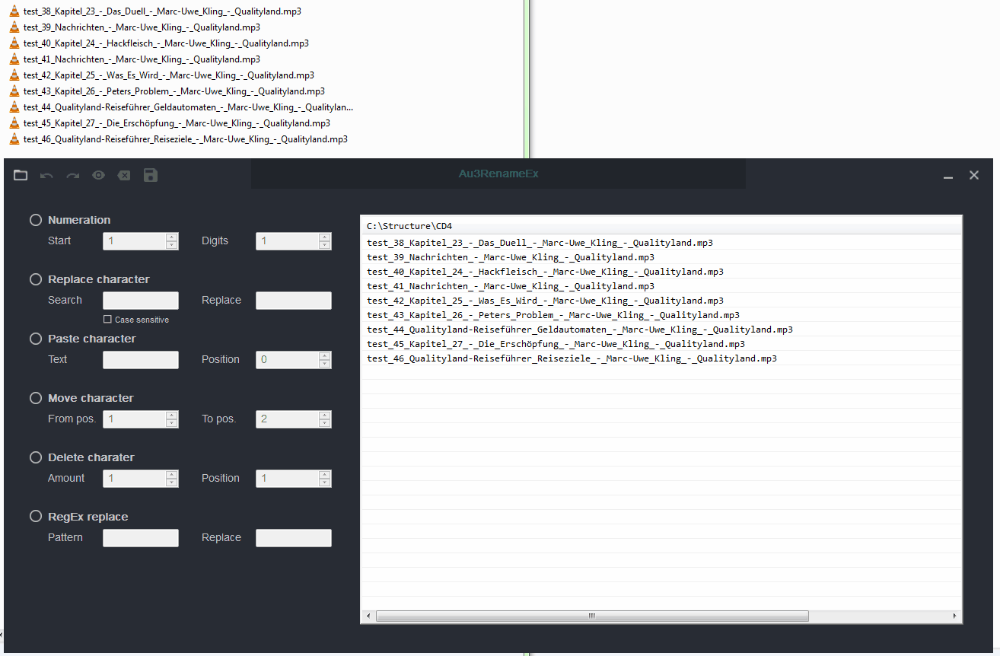
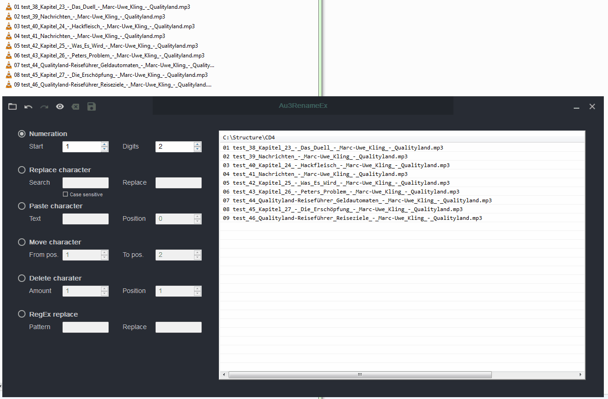
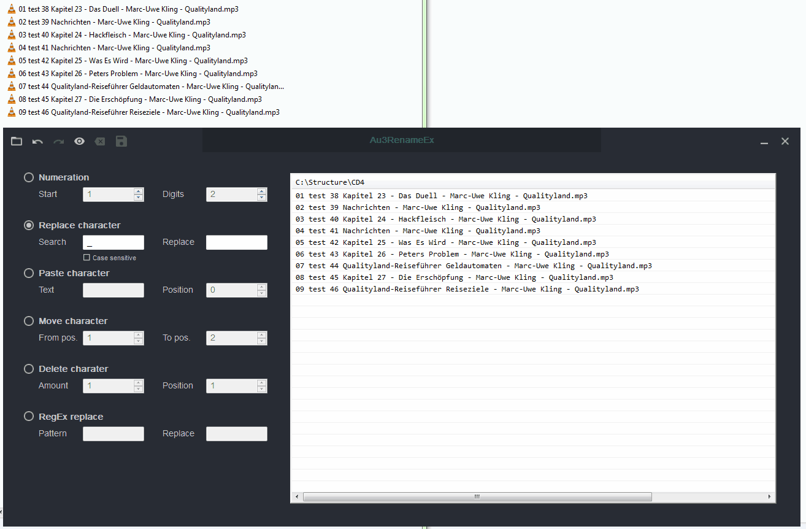
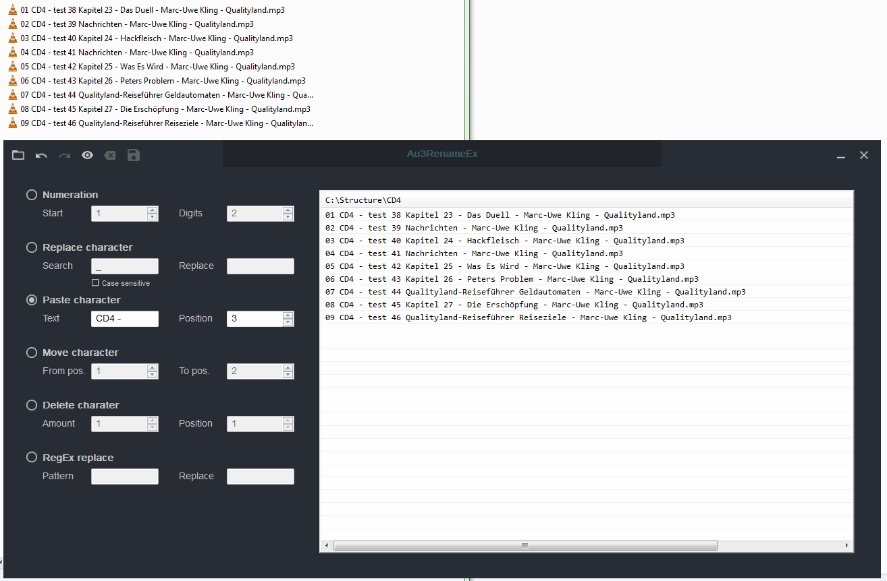
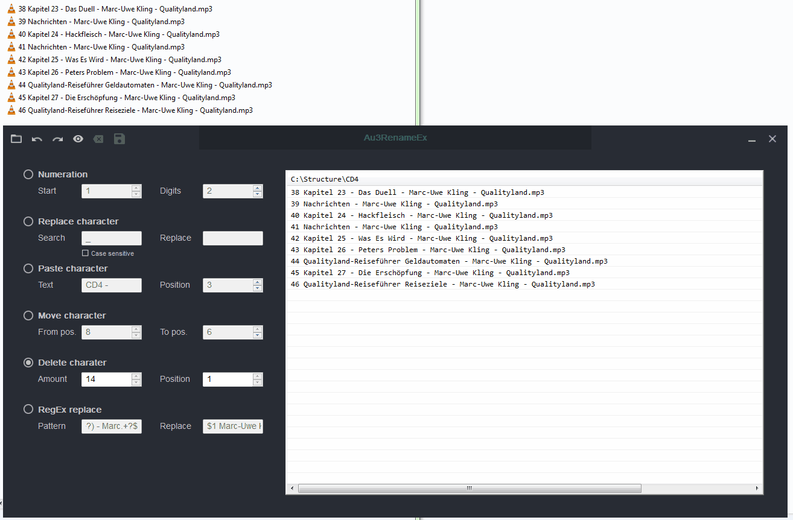
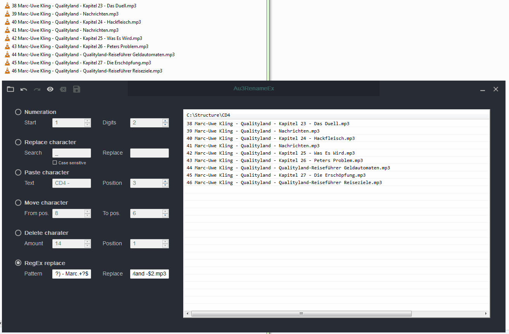

#####

    
    <h2 align="center">Welcome to <code>Au3RenameEx</code> !</h2>

[Description](#description) | [Features](#features) | [Getting started](#getting-started) | [Configuration](#configuration) | [Keyboard Shortcuts](#keyboard-shortcuts) | [Tested](#tested) | [Contributing](#contributing)

## Description

Au3RenameEx is a multiple files renaming tool. It's for structured renaming of files in the same way.
Common use cases are music files, audio books, ebooks or other types of collections which should be renamed.

## Features

1. Multilingualism is possible.
    - Already available languages are *en*  and *de* 
    - Easy extendable through file `config\language.ini`

2. Simultaneously renaming of files in multiple folders are possible.

3. Numeration with several digit size

    

4. Replace characters (with case sensitive option)

    

5. Paste characters to position

    

6. Move character to position

    

7. Delete characters

    

8. Replace by RegEx pattern (most powerful)

    

9. Undo and Redo your changes

    

10. Input exception handling prevents false renaming

    

## Getting started

#### Preconditions

Please ensure you have access to your default TEMP directory, because two files will be saved there.
Adjustable in `src\Declaration.au3` file.

#### Variant 1 - Run the EXE

Starting the EXE `src\Au3RenameEx.exe` which is compiled with `#AutoIt3Wrapper_UseX64=y` and `#AutoIt3Wrapper_UseUpx=n` (the default expected system is x64).

#### Variant 2 - Compile it on your own

Open file `src\Au3RenameEx.au3`, adjust the *#AutoIt3Wrapper compiler information* if you want to (for example `#AutoIt3Wrapper_UseX64=y`) and run the program or compile the program.

## Configuration

- You can adjust the language of the program by file `config\language.ini`. Just edit the key `ChosenLanguage = 'en'` to maybe 'de'.
- If you need an other language please add a new INI section in this file.
    - For example spanish (español) section `[es]` with all the key-value structure.
    - I appreciate when you share your language by pull request, thanks.

## Keyboard Shortcuts

| Action        | Shortcut |
| :------------ | :------- |
| Open Folder   | `Ctrl+O` |
| Undo          | `Ctrl+Z` |
| Redo          | `Ctrl+Y` |
| Preview       | `Ctrl+P` |
| Reset preview | `Ctrl+R` |
| Rename/Save   | `Ctrl+S` |

## Tested

> SUT (system under test)

| Property       | Win 7       | Win 10          | Win 10 Tablet |
| :------------- | :---------- | :-------------- | :------------ |
| @AutoItExe     | autoit3.exe | autoit3_x64.exe | autoit3.exe   |
| @AutoItVersion | 3.3.14.2    | 3.3.14.2        | 3.3.14.5      |
| @CPUArch       | X64         | X64             | X64           |
| @OSArch        | X64         | X64             | X86           |
| @OSVersion     | WIN_7       | WIN_10          | Win_10        |

## Contributing

Just look at [CONTRIBUTING](https://github.com/Sven-Seyfert/Au3RenameEx/blob/master/docs/CONTRIBUTING.md), thank you!

##

[To the top](#)
