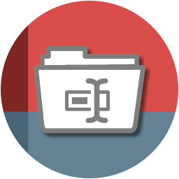

#####

    
    <h2 align="center">Welcome to <code>Au3RenameEx</code>【ツ】</h2>

[Description](#description) | [Features](#features) | [Getting started](#getting-started) | [Configuration](#configuration) | [FAQ](#faq) | [Contributing](#contributing) | [License](#license) | [Acknowledgements](#acknowledgements)

## Description

Au3RenameEx is a multiple files renaming tool. It's for structured renaming of files in the same way.
Common use cases are music files, audio books, ebooks or other types of collections which should be renamed.

## Features

1. Multilingualism is possible.
    - Already available languages are *en*  and *de* 
    - Easy extendable through file `config\language.ini`

2. Simultaneously renaming of files in multiple folders are possible.

3. Various renaming options
 

  

  
<i>Numeration with several digit size</i>

  
 

  

  

  
<i>Replace characters (with case sensitive option)</i>

  
 

  

  

  
<i>Paste characters to position</i>

  
 

  

  

  
<i>Move character to position</i>

  
 

  

  

  
<i>Delete characters</i>

  
 

  

  

  
<i>Replace by RegEx pattern (most powerful)</i>

  
 

  

  

  
<i>Timestamp as filename</i>

  
 

  

  

  
<i>Undo and Redo your changes</i>

  
 

  

  

  
<i>Input exception handling prevents false renaming</i>

  
 

  

## Getting started

#### *Preconditions*

Please ensure you have access to your default TEMP directory, because two files will be saved there.
Adjustable in `src\Declaration.au3` file.

#### *Installation*

Variant 1 - Run the EXE:

Starting the EXE `build\Au3RenameEx.exe` which is compiled with `#AutoIt3Wrapper_UseX64=y` and `#AutoIt3Wrapper_UseUpx=n` (the default expected system is x64).

Variant 2 - Compile it on your own:

Open file `src\Main.au3`, adjust the *#AutoIt3Wrapper compiler information* if you want to. For example you could change `#AutoIt3Wrapper_UseUpx=n` from no (n) to yes (y), etc.
Then, run or compile the program.

#### *Usage*

See the animated GIFs in the "Features" section above.

#### *Keyboard shortcuts*

| Action        | Shortcut |
| :---          | :---     |
| Open Folder   | `Ctrl+O` |
| Undo          | `Ctrl+Z` |
| Redo          | `Ctrl+Y` |
| Preview       | `Ctrl+P` |
| Reset preview | `Ctrl+R` |
| Rename/Save   | `Ctrl+S` |

## Configuration

- You can adjust the language of the program by file `config\language.ini`. Just edit the key `ChosenLanguage = 'en'` to maybe 'de'.
- If you need an other language please add a new INI section in this file.
    - For example spanish (español) section `[es]` with all the key-value structure.
    - I appreciate when you share your language by pull request, thanks.

## FAQ

<i>Frequently Asked Questions</i>
 

  

  
<code>1. How to [...]</code>

  **Q:** Is there a frequently asked question already? 
  **A:** No, not yet.

   

  

  
<code>2. How to [...]</code>

  **Q:** [...]? 
  **A:** [...].

   

## Contributing

Just look at [CONTRIBUTING](https://github.com/Sven-Seyfert/Au3RenameEx/blob/master/docs/CONTRIBUTING.md), thank you!

## License

Distributed under the MIT License. See [LICENSE](https://github.com/Sven-Seyfert/Au3RenameEx/blob/master/LICENSE.md) for more information.

## Acknowledgements

- Opportunity by [GitHub](https://github.com)
- Badges by [Shields](https://shields.io)
- Utilities components by
  - [MrCreatoR](https://www.autoitscript.com/forum/files/file/179-guictrlonhover/) (UDF GuiCtrlOnHover.au3); [LICENSE](https://github.com/Sven-Seyfert/Au3RenameEx/blob/master/utilities/GuiCtrlOnHover.LICENSE.md)

##

[To the top](#)
